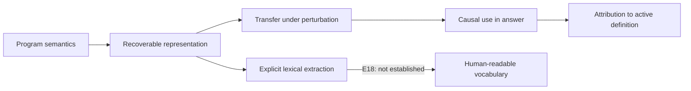
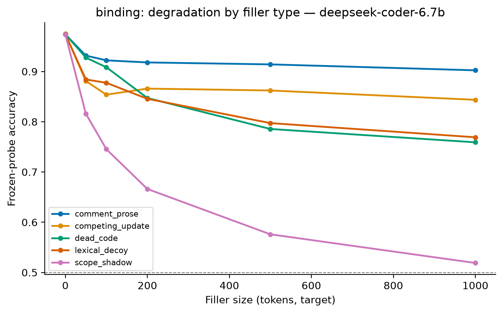
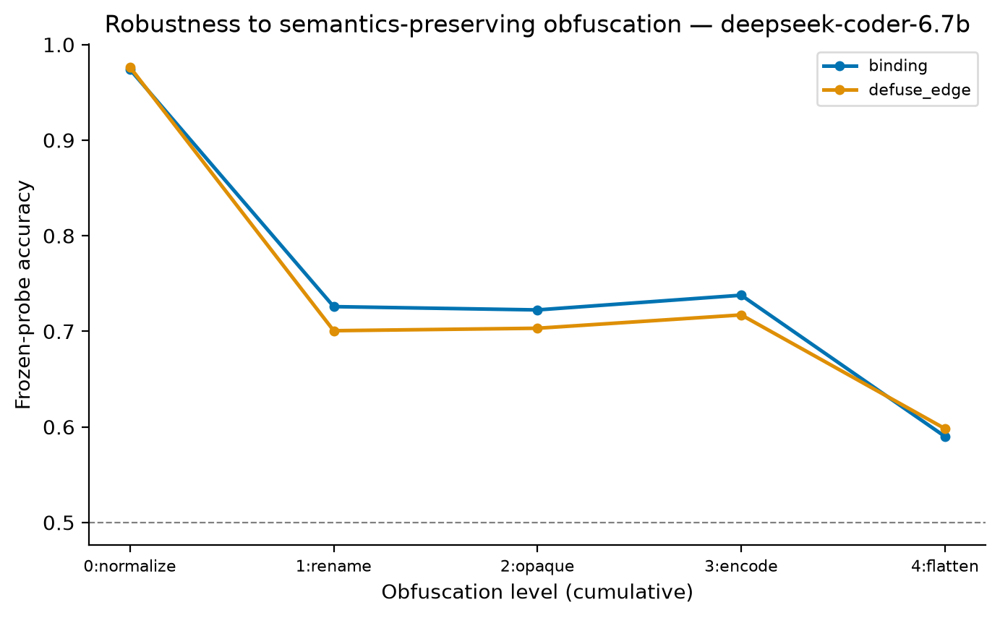
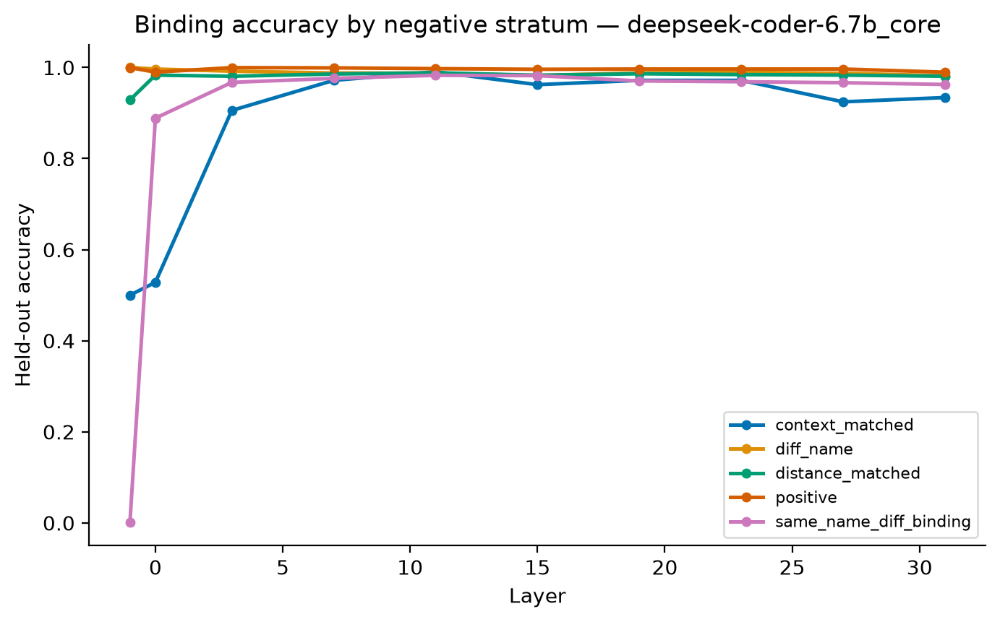

# From Decodable Structure to Governed Reasoning: Auditing Semantic Grounding in Code Language Models

**Anonymous authors**

> **Draft scope.** This manuscript is designed for a paper of at most ten pages,
> excluding references and supplementary material. It deliberately advances a
> narrow empirical claim: semantic grounding is a necessary component of
> trustworthy code reasoning, and variable binding provides a controlled case in
> which representation, robustness, causal use, attribution, and explicit lexical
> expression can be tested separately. It does not claim that passing these tests
> is sufficient for safe deployment.

## Abstract

Code language models are increasingly proposed for consequential work in
software engineering and security, where a plausible answer is not enough: the
answer should be governed by the program's semantics rather than by lexical
correlations that can be misleading or adversarially manipulated. Yet standard
benchmarks rarely distinguish a model that resolves program structure from one
that exploits surface regularities. We present a controlled audit of variable
binding in pretrained code models. Our design holds the queried token, its
position, and bounded local context fixed while changing which definition is in
scope. We then test five progressively stronger properties of the resulting
internal representation: linear recoverability, robustness under
meaning-preserving and structure-changing perturbations, causal use in forming
the answer, attribution of the answer to the active definition, and explicit
alignment with scope vocabulary through an unprompted J-lens. Binding is absent
from the input representation but reaches approximately 0.984 probe accuracy in
middle layers over an exact 0.500 surface floor. Frozen probes tolerate long
irrelevant context and consistent renaming better than competing scopes or
control-flow flattening. A rank-1 Distributed Alignment Search intervention at
the unchanged use token installs the donor binding and produces the corresponding
answer on 100% of held-out examples in two crossed value arms, in DeepSeek-Coder
6.7B and StarCoder2 3B. On DeepSeek-Coder 6.7B, a conserving relevance lens
reassigns the unchanged answer score from the definition leaving scope to the
one entering scope, peaking near 22% of the answer score. However, no one of nine
predeclared semantic word contrasts is exceptional relative to 500 Gram-matched
readout directions in both arms. These findings show a representation that is
recoverable, structurally fragile, causally used, and attributionally connected
to the answer, but not transparently verbalised at the same state. We argue that
this decomposed audit is a useful foundation for semantic governance: it reveals
both evidence for genuine program reasoning and concrete boundaries beyond which
trust is not warranted.

## 1. Introduction

Code models are moving from autocomplete toward agents that inspect
vulnerabilities, modify repositories, review patches, operate build systems, and
interact with production infrastructure. In these settings, behavioral success
on familiar distributions is an incomplete basis for trust. Source code contains
many regularities that correlate with correct behavior—identifier names,
formatting, common templates, nearby tokens, and conventional control-flow
shapes—but those regularities are not the semantics of the program. They may be
uninformative in unusual code and actively misleading in obfuscated, adversarial,
or security-sensitive code. A model entrusted with consequential actions should
therefore not merely produce correct answers; its computation should be grounded
in the program relations that govern those answers.

We use **semantic grounding** in a deliberately operational sense. Let a program
property (S(x)) be defined independently by programming-language semantics—for
example, which definition a variable use resolves to. A model is semantically
grounded with respect to (S) only if its internal computation is sensitive to
changes in (S), invariant to changes that preserve (S), and causally uses an
internal representation of (S) when producing the relevant output. This is
stronger than benchmark accuracy and stronger than probing alone. A probe can
decode information that the model never uses; a behavioral task can be solved by
a shortcut; an attribution map can appear intuitive without being causal; and an
internal feature can be causally important without being human-readable.

Variable binding is a useful minimal case. In the programs below, the queried
token `x` is identical and appears at the same position, but one character in an
earlier assignment changes whether the use resolves to the outer or inner
definition:

```python
x = 3                  x = 3
def f():               def f():
    y = 7                  x = 7
    return x               return x
# returns 3             # returns 7
```

No bounded reader of the queried token can distinguish these cases. Correctly
predicting the value requires resolving scope and linking the use to the active
definition. This construction lets us ask not simply whether a model gets an
answer right, but what information it forms, how that information changes under
perturbation, and whether downstream computation actually depends on it.

Our audit separates five questions that are often collapsed:

1. **Representation:** Is binding linearly recoverable above a measured surface
   floor?
2. **Robustness:** Does the same frozen representation survive semantic-preserving
   perturbations, and does it fail specifically under structural interference?
3. **Causal use:** Does intervening on a compact binding component change the
   answer according to the installed binding rather than toward one fixed token?
4. **Answer formation:** Is the unedited answer score attributed to the
   definition that is actually active?
5. **Explicit extraction:** Is the representation transparently aligned with
   scope vocabulary in the model's output coordinates at the same unprompted
   state?

The resulting picture is neither “only lexical pattern matching” nor “a fully
explicit symbolic interpreter.” Binding becomes linearly available in early to
middle layers, survives many surface changes, and is causally read from a rank-1
component. At the same time, competing scope and flattened control flow degrade
the frozen readout, and semantic word directions are not distinguishable from
matched random orientations. This combination is the paper's central result:
**the models exhibit real but bounded semantic grounding**. Such evidence can
support more disciplined trust decisions, but it also identifies cases in which
lexical or structural distribution shift should reduce confidence.

Our contributions are:

- a paired construction with an exact 0.500 surface floor for variable binding;
- a unified audit spanning representation, perturbation, causal intervention,
  relevance attribution, and vocabulary-level extraction;
- a crossed intervention design that separates binding transport from a fixed
  answer-token push;
- evidence that structural interference, rather than distance alone, is the
  dominant failure mode of the frozen representation; and
- a valid negative showing that high lexical reversal rates do not imply clear
  verbalisation once variation over matched readout directions is measured.

## 2. Security and governance framing

For a code model, “reasoning governance” should mean more than constraining the
final string. It should include evidence that internal decisions are controlled
by the program facts that normatively determine the answer. If a vulnerability
analysis depends on which value reaches a sink, or a patch depends on which
definition a use references, then the relevant data-flow and binding relations
should influence the model's computation even when identifiers are renamed,
irrelevant context is inserted, or lexical cues conflict with scope.

This motivates three levels of assurance. **Behavioral assurance** asks whether
the model answers correctly on a test distribution. **Representational
assurance** asks whether the governing semantic variable is recoverable and
stable under controlled transformations. **Causal assurance** asks whether
changing that internal variable changes the answer as the semantic theory
predicts. The latter two do not replace behavioral evaluation, but they help
distinguish robust reasoning from accidental success.

This paper does not equate interpretability with governance. An internal feature
can be interpretable yet unused; a causal feature can be used in combination
with unsafe heuristics; and a model can pass a local binding audit while failing
on aliasing, dynamic dispatch, concurrency, or interprocedural reasoning. Our
claim is instead methodological: consequential use calls for evidence about the
variables governing the model's answers, and such evidence should be assembled
as a chain rather than inferred from any single probe or explanation.



**Figure 1. Semantic-grounding audit.** Arrows denote separate empirical claims,
not logical implications. In particular, decodability does not imply causal use,
and causal use does not imply explicit verbalisation.

## 3. Related work

Pretrained code models such as CodeBERT and GraphCodeBERT established that
Transformer representations can support code search, generation, and probing;
GraphCodeBERT explicitly incorporates data-flow structure during pretraining
[Feng et al., 2020; Guo et al., 2021]. Such task performance, however, does not
by itself determine whether a model internally relies on program semantics or
surface correlations. Work on compositional generalization and adversarial code
transformations similarly shows why standard in-distribution accuracy is an
insufficient account of structural understanding.

Our representational analysis follows the probing tradition but adopts its main
caution: a classifier's accuracy must be interpreted against controls for probe
capacity and surface memorization [Hewitt and Liang, 2019]. We therefore report
shuffled-label selectivity, grouped splits, embedding-layer behavior, and a
model-free local surface reader on the exact same examples. The exact 0.500
surface floor is not assumed from intuition; it is measured and pinned by the
paired construction.

Causal abstraction work distinguishes information present in a representation
from information used with the causal role of an interpretable variable [Geiger
et al., 2021]. Distributed Alignment Search (DAS) learns alignments between
high-level variables and distributed neural representations and tests them with
interchange interventions [Geiger et al., 2023]. We use DAS to align the
high-level variable “which definition is in scope” with a rank-1 component at the
variable-use state. Our crossed value assignment is central: it forces the
correct output direction to reverse between fitting and evaluation, separating
binding from a fixed answer feature.

Finally, attribution and vocabulary lenses serve different purposes from causal
intervention. Our relevance lens decomposes an unchanged output score under
specified backward rules; it describes answer attribution but cannot establish
necessity. Our J-lens asks whether a hidden state aligns with candidate output
words after accounting for the remaining network. Because a nearly rank-1 state
shift can make arbitrary directions appear consistently responsive, we compare
the lexical rows with many Gram-matched random directions rather than with 0.5
alone.

## 4. Formal problem statement

Let (x) denote a program, (u) the position of a variable use, and
(B(x,u)\in\{0,1\}) the binding selected by language semantics: (0) for the
outer definition and (1) for the inner definition. A frozen autoregressive
model produces hidden state

\[
h_\ell(x,u)\in\mathbb{R}^d
\]

at layer (\ell). Our paired generator constructs (x^{(0)}) and (x^{(1)})
such that (B(x^{(0)},u)\neq B(x^{(1)},u)), while the token at (u), its index,
and its bounded local context are identical. The pair differs at one earlier
identifier token.

We operationalize the audit through five properties.

**Recoverability.** A linear probe (q_\ell) should predict (B) from
(h_\ell) above a surface baseline (s(x,u)):

\[
\mathrm{Acc}(q_\ell(h_\ell),B)-\mathrm{Acc}(s,B)>0.
\]

**Transfer.** For a semantics-preserving transformation (T), a probe fitted on
clean programs remains frozen. We measure

\[
\Delta_T(\ell)=\mathrm{Acc}(q_\ell(h_\ell(T(x),u_T)),B(x,u))
                 -\mathrm{Acc}(q_\ell(h_\ell(x,u)),B(x,u)).
\]

Sensitivity to semantic interference and invariance to surface changes are both
required; indiscriminate invariance would be as uninformative as indiscriminate
sensitivity.

**Causal use.** DAS learns an orthonormal rank-1 basis (R\in\mathbb{R}^{d\times
1}). Given host and donor states, the interchange is

\[
h'_\ell=h_\ell^{\mathrm{host}} + RR^\top
         \left(h_\ell^{\mathrm{donor}}-h_\ell^{\mathrm{host}}\right).
\]

If (R) realizes binding, the intervened model should emit the value selected by
the donor binding, including when the mapping from binding to answer token is
reversed in the held-out arm.

**Attribution.** For selected answer score (f_y(x)), the relevance lens
produces token contributions (r_i) satisfying approximate conservation,

\[
\sum_i r_i \approx f_y(x).
\]

We ask whether changing (B) reallocates relevance from the definition becoming
inactive to the definition becoming active, including when those definition
tokens are unchanged.

**Lexical expression.** For a predeclared word pair
((w_{\mathrm{in}},w_{\mathrm{out}})), the J-lens margin is

\[
m_\ell(x)=J_\ell(h_\ell(x,u))_{w_{\mathrm{in}}}
           -J_\ell(h_\ell(x,u))_{w_{\mathrm{out}}}.
\]

The counterfactual shift is (\delta=m_\ell(x^{(1)})-m_\ell(x^{(0)})), with
predicted sign (\delta>0). The reversal rate is compared with readouts whose
row Gram matrix equals the J-lens Gram matrix, so norms and pairwise angles are
held fixed while residual-stream orientation is randomized.

## 5. Experimental design

### 5.1 Models and data

We study pretrained base code models rather than instruction-tuned chat models:
DeepSeek-Coder 1.3B and 6.7B, plus StarCoder2 3B where the relevant architecture
and behavioral gates permit interpretation. Ground truth is derived from parsed
program structure: abstract syntax, control flow, and reaching-definition/data-
flow relations. Token spans are aligned to graph nodes and checked for tokenizer
integrity. Generated examples are grouped by base program so paired variants
cannot leak across train and test folds.

The binding factorial crosses two variables:

| Arm | Outer value | Inner value | Installing inner binding requires |
|---|---|---|---|
| `ab` | `a` | `b` | answer `a → b` |
| `ba` | `b` | `a` | answer `b → a` |

DAS is fitted on `ab` and evaluated on `ba`. The J-lens and R-lens report both
arms separately. Calibration bases are used for fitting and selection; frozen
test bases are read once for claims.

The experiments do not all license claims for every model. This is a deliberate
consequence of capability and architecture gates rather than missing rows:

| Experiment | DeepSeek 1.3B | DeepSeek 6.7B | StarCoder2 3B | Why coverage differs |
|---|---:|---:|---:|---|
| Binding/def–use probes | reported | reported | reported where strata pass | forward hidden states suffice |
| Perturbation transfer | reported | reported | reported | same frozen-probe protocol |
| DAS binding interchange | capability result only | **causal claim** | **causal claim** | answer behavior and intervention gates must pass |
| R-lens attribution | invalid normalized shares | **attribution claim** | not applicable | 1.3B has non-positive target scores; StarCoder2 does not match the implemented rules |
| J-lens verbalisation | not run as headline | **valid negative** | not run | canonical direction-null run is currently 6.7B only |

### 5.2 Probes and surface controls

The pairwise probe reads

\[
z_{ij}=[h_i;h_j;h_i-h_j;|h_i-h_j|]
\]

with a linear classifier. Negative examples include different-name,
distance-matched, same-name/different-binding, and context-matched strata. The
context-matched stratum is the headline because the fixed-offset local features
are identical while the semantic label changes. A model-free baseline receives
only token IDs in a bounded window and distance. We also evaluate at the input
embedding and under shuffled labels.

### 5.3 Perturbations

Two families of transformations test frozen-probe transfer. Context insertions
hold length approximately fixed while varying semantic interference: inert
comments, dead code, lexical decoys, updates to unrelated variables, and nested
scope shadows reusing the tracked names. An execution-verified obfuscation ladder
applies normalization, consistent renaming, opaque predicates, mixed Boolean-
arithmetic rewrites, and control-flow flattening. Labels are recomputed after
transformation, and all levels of a base are retained or dropped together.



**Figure 2. Frozen binding-probe transfer under inserted context.** Long inert
context is substantially less damaging than scope interference involving the
tracked names.



**Figure 3. Frozen binding-probe transfer through the obfuscation ladder.** Early
layers are strongly lexical; middle layers survive renaming, while control-flow
flattening causes the largest cross-model collapse.

### 5.4 Causal and explanatory readouts

DAS learns a rank-1 binding alignment at the use token. Controls include the
crossed arm, a J-lens-derived answer direction matched to the DAS edit norm,
dose- and rank-matched random subspaces, a no-op, a whole-state donor patch, and
a closed-form donor-minus-host mean direction. The primary outcome is the
full-vocabulary emitted token, not only a two-token logit margin.

The R-lens propagates the selected bound-value score backward under conserving
rules and aggregates token relevance into syntactic roles. Forward equivalence,
module attachment, conservation, role coverage, and same-program zero controls
must pass before interpretation. The J-lens verbalisation experiment uses nine
predeclared single-token pairs—four scope, three positional, and two action
contrasts—and 500 Gram-matched directions. A pair is clear only if reversal is at
least 0.80 and at or above the 0.99 random-direction percentile in both arms; the
headline additionally requires repetition at adjacent tested layers.

### 5.5 Claim discipline and mechanical gates

Each result is guarded by checks that are intentionally independent of whether
the scientific outcome is positive. Tokenization and graph-to-token alignment
must preserve the intended anchors; paired programs must differ in exactly the
declared location; all cells and both crossed arms must be present; calibration
and test bases must be disjoint; intervention no-ops must be exact; relevance
must conserve the selected score; and random J-lens rows must reproduce the real
lens Gram matrix. A failed mechanical gate invalidates the measurement rather
than becoming a negative result.

The distinction matters most for E18. Its binding probe is a positive control,
not evidence for lexical expression. If the probe failed, a word-level null
would show only that the tested state lacked measurable binding. Because the
probe is perfect while the direction-specific lexical criterion fails, the null
instead separates “represented” from “explicitly aligned with these words.”
Likewise, the failed 1.3B normalized R-lens result is not treated as absence of
binding attribution: the denominator required to interpret relevance as a share
is non-positive in part of that condition, so the instrument is invalid there.

## 6. Results

### 6.1 Binding is constructed contextually

The decisive context-matched binding probe is exactly at chance for both the
model-free reader and input embeddings, then rises sharply through early blocks
and plateaus near 0.984 in the middle.

| Measurement | DeepSeek 1.3B | DeepSeek 6.7B |
|---|---:|---:|
| Surface baseline | **0.500** | **0.500** |
| Embedding layer | **0.500** | **0.500** |
| Block 0 | 0.570 | 0.531 |
| Layer 3 | 0.961 | 0.914 |
| Peak | **0.984 (L7)** | **0.984 (L11–15)** |
| Last layer | 0.930 | 0.914 |



**Figure 4. Binding-probe accuracy by negative stratum and layer.** Only the
context-matched stratum provides the clean semantic headline; easier strata are
partly solvable from surface features.

This profile supports a representation claim rather than a task-performance
claim. The binding distinction is absent from the queried input token and is
constructed by contextual processing. Definition-to-use edges show a related
profile. Here the label is whether a directed reaching-definition edge connects
one token to another, and negative examples are distance-matched so that a
nearest-token heuristic cannot solve the task. Accuracy peaks near 0.99 at
layers 7–11 and remains approximately 0.96–0.99 for endpoints separated by
50–200 tokens. The binding and def–use experiments therefore provide two related
structural observations: the model represents which definition is active and
which use it reaches. Neither probe alone establishes that these relations
control the output; that stronger claim is reserved for the binding DAS result.

### 6.2 Robustness follows semantic difficulty more than distance

#### Context interference experiment

At 500 inserted tokens, DeepSeek-Coder 6.7B retains 0.921 binding accuracy with
inert prose comments. Dead code and lexical decoys yield approximately 0.794–
0.795, unrelated competing updates 0.859, but tracked-name scope shadows reduce
accuracy to 0.570. At 1,000 tokens, scope shadow reaches 0.498 while all other
fillers remain above 0.70. The principal cost is therefore not sequence length
alone; it is interference with the relation the probe reads.

This comparison holds added-token budget approximately fixed while changing
what the inserted text does. Its licensed claim is comparative: tracked-name
scope interference damages transfer much more than inert distance. It does not
show that long context is universally harmless, nor that a failed frozen probe
means the model has forgotten binding.

#### Obfuscation and control-flow experiment

The obfuscation results reinforce this distinction. Consistent renaming damages
early lexical layers, even pushing some early probes below chance, while middle
layers remain around 0.85–0.90. Across the tested models, control-flow flattening
is the largest reproducible failure:

| Task and model | Rename | Opaque | Arithmetic encoding | Flatten |
|---|---:|---:|---:|---:|
| Binding, 1.3B | 0.783 | 0.801 | 0.834 | **0.555** |
| Binding, 6.7B | 0.883 | 0.862 | 0.857 | **0.615** |
| Binding, StarCoder2 | 0.708 | 0.743 | 0.790 | **0.527** |
| Def–use, 1.3B | 0.819 | 0.799 | 0.800 | **0.461** |
| Def–use, 6.7B | 0.864 | 0.846 | 0.833 | **0.545** |
| Def–use, StarCoder2 | 0.689 | 0.731 | 0.747 | **0.402** |

These are frozen-readout results. They establish where the original
representation transfers, not that every alternative representation disappears
when the probe fails. For security, that distinction is important: the results
identify a confidence boundary, not a universal impossibility theorem.

### 6.3 A rank-1 component causally controls the answer

DAS reaches 100% installed-answer accuracy in both crossed arms and both
interpretable architecture families:

| Intervention | DeepSeek `ab` | DeepSeek `ba` | StarCoder2 `ab` | StarCoder2 `ba` |
|---|---:|---:|---:|---:|
| **DAS, rank 1** | **100.0%** | **100.0%** | **100.0%** | **100.0%** |
| Whole-state donor patch | 85.7% | 87.9% | 68.8% | 67.3% |
| Mean donor−host direction | 76.1% | 76.8% | 54.6% | 54.5% |
| Answer direction | 27.9% | 4.3% | 44.8% | 18.4% |
| Dose-matched random | 2.1% | 1.8% | 30.9% | 30.4% |

Because the correct output direction reverses in `ba`, success cannot be
explained by a fixed push toward token `b`. The answer-direction control
attenuates from 27.9% to 4.3% on DeepSeek, whereas DAS remains perfect. The
closed-form mean direction is a meaningful positive baseline but is less
reliable and requires a larger edit: approximately 0.71 of the state norm versus
0.48 for DAS. This is the strongest evidence that the model does not merely
contain binding information; downstream computation uses a compact component
with the causal role of the binding variable.

### 6.4 The answer is attributed to the active definition

On DeepSeek-Coder 6.7B, the R-lens shift has the predicted sign on all 280
held-out bases. At the first measured layer, the newly active inner value gains
approximately 4.9% of the answer score and the newly inactive outer definition
loses approximately 7.8%, a combined redistribution of 12.6%. The shift rises to
about 21.9% in the middle and declines to 2.5% near the output. The single changed
identifier token accounts for only about 1.5% of the movement.

The effect appears in both value arms, survives fixed-output-token scoring,
reverses when the competing value is scored, and is absent in same-binding
controls. It is therefore consistent with answer attribution following the
active definition rather than responding locally to the changed name. This is
observational evidence. It complements but does not amplify the causal status of
DAS.

### 6.5 The binding state is not transparently verbalised

The J-lens experiment is mechanically valid: all 1,600 exactness cells pass, all
nine word pairs survive tokenization, and the matched binding probe is 1.000 at
L8, L12, L16, L20, and L24. Several word pairs nevertheless illustrate why raw
reversal is insufficient:

| Pair and layer | Reversal `ab` / `ba` | Worse-arm random percentile | Clear? |
|---|---:|---:|---:|
| `nested/module`, L16 | 1.000 / 1.000 | 0.953 | No |
| `local/global`, L20 | 0.996 / 1.000 | 0.936 | No |
| `nested/module`, L24 | 0.993 / 0.996 | 0.927 | No |
| `local/global`, L24 | 0.986 / 0.993 | 0.915 | No |
| positional `later/earlier`, L16 | 1.000 / 1.000 | 0.964 | No |

No scope, positional, or action pair reaches the declared 0.990 percentile in
both arms at any layer; consequently, none can repeat at adjacent layers. The
honest conclusion is not that “scope words are absent,” since their raw margins
often move strongly. It is that the observed movement is not specific to those
semantic directions: readouts with identical geometry and random orientation
produce comparably consistent changes.

This valid negative is conceptually important. A causally used semantic
representation need not be organized in a basis that maps transparently onto
human vocabulary at the state where it operates. Conversely, a vocabulary-like
readout should not be accepted as an explanation without a direction-level
control.

### 6.6 Findings in one view

| Audit link | Outcome | What is established | What is not established |
|---|---|---|---|
| Representation | Pass | binding is linearly recoverable above exact surface/input floors | that the model uses it |
| Perturbation | Mixed | transfer is robust to many surface changes; fragile to scope and flattened flow | absence of every alternative encoding |
| Causal use | Pass | rank-1 interchange controls the answer according to binding | causal use at every layer, site, or program family |
| Attribution | Pass on 6.7B | answer relevance shifts toward the active definition | a causal explanation or complete mechanism |
| Explicit lexical extraction | Valid negative | no tested word pair is direction-specific at the unprompted state | inability to discuss scope when prompted |

## 7. Discussion

### 7.1 Evidence for semantics rather than lexical matching

No individual result is sufficient to establish semantic reasoning. Their
conjunction is more informative. The exact embedding and surface null shows that
the binding label is not locally encoded in the queried token. The rise through
layers shows contextual construction. Renaming resistance in middle layers shows
partial independence from identifier strings. Greater sensitivity to competing
scope than to inert distance ties failure to semantic difficulty. The crossed
DAS intervention demonstrates causal use independent of a fixed answer token.
Finally, the R-lens links the unchanged output score to the semantically active
definition. Together, these observations are difficult to reconcile with a
purely lexical account.

They also reject an overly strong semantic account. The frozen representation is
not invariant to all meaning-preserving transformations. Flattening and scope
interference sharply reduce transfer, early layers can be actively misled by
renaming, and explicit lexical extraction fails its matched-direction test. The
models appear to compute a useful binding relation, but that computation remains
entangled with learned structural and lexical conventions.

### 7.2 Implications for security-sensitive deployment

The practical implication is a **conditional trust policy**. Tasks dominated by
ordinary lexical patterns may hide semantic weaknesses because those patterns
usually agree with program meaning. Confidence should fall when the input
contains adversarial naming, unfamiliar control-flow lowering, deeply competing
scopes, generated dispatch loops, macro-like rewrites, or other constructions in
which lexical and semantic evidence diverge. These are not merely “hard
examples”; they target the dimensions on which the measured binding readout
loses transfer.

For security tooling, semantic audit cases should therefore complement standard
accuracy benchmarks. A vulnerability detector should be tested under renaming,
dead-code insertion, equivalent control-flow rewrites, and semantic-conflict
cases where the correct conclusion cannot be obtained from token proximity. An
agent that proposes consequential changes should ideally expose calibrated
signals that its relevant semantic representations remain within a validated
regime. Our probes are research instruments rather than deployment monitors, but
the results motivate such monitors and transformation-based confidence tests.

The absence of explicit J-lens verbalisation adds a second caution. Asking a
model to explain which definition is in scope may produce a plausible verbal
answer, but that explanation need not be a direct readout of the causally used
state. Human-readable rationales should not be treated as faithful solely because
they use correct semantic terminology. Governance mechanisms should combine
behavioral tests, causal audits, and provenance/constraint enforcement rather
than relying on self-explanation.

### 7.3 What “governed reasoning” can mean operationally

This study suggests four measurable requirements for governed semantic
reasoning:

1. The governing program variable is recoverable over a measured shortcut floor.
2. The representation is invariant to transformations known to preserve that
   variable and sensitive to transformations that change or obscure it.
3. Causal intervention on the representation changes the model's decision in
   accordance with the variable across counterbalanced outputs.
4. Deployment abstention or review is triggered outside the transformation and
   program regimes for which these properties were validated.

The fourth requirement lies beyond our experiments but follows from them. An
audit is useful for governance only if its boundaries influence how the system
is deployed. Our results support neither unconditional trust nor blanket
dismissal. They support a scoped assurance case whose evidence and failure modes
are explicit.

## 8. Limitations and threats to validity

The principal limitation is external validity. The causal binding experiment is
a small synthetic Python construction with one lexical mutation, one use site,
and scalar literal answers. This control is what makes the causal claim possible,
but it does not cover real repository scale, interprocedural aliases, objects,
closures, mutation through containers, exceptions, concurrency, or dynamic
language features. The next step is not simply more generated names; it is
context-matched counterfactuals embedded in diverse real code.

The model scope is also limited. Representation and robustness span three model
families where reported, but the clean R-lens attribution applies only to
DeepSeek-Coder 6.7B, and the J-lens verbalisation result is currently only for
that model. DeepSeek-Coder 1.3B does not provide an interpretable normalized
R-lens result because some selected scores are non-positive. StarCoder2's
architecture is outside the implemented relevance rules.

Probe transfer failure is not proof of representation erasure. A transformed
program may encode binding in a rotated or nonlinear form that a clean-trained
linear probe cannot read. Conversely, high probe accuracy is not proof of use;
this is why DAS is essential. DAS itself is local: it identifies a successful
rank-1 intervention at one position and layer, not a unique global mechanism.
Its superiority to a whole-state donor patch suggests that the full state may
carry opposing components, an explanation that remains untested.

The R-lens is rule-dependent and observational. Conservation verifies an
accounting identity but does not prove that the resulting partition is the
unique causal explanation. Its attention rule freezes query/key pattern
formation, so it cannot establish the intuitive story that the model “attends to
the correct definition.” Generated bases share one template, and a mismatched-
base control reproduces the mean shift; attribution effect sizes should therefore
be read as properties of the controlled contrast, not diverse natural programs.

The J-lens instrument has limited early-layer stability. Independent-build sign
agreement exceeds 0.90 only at L24, and its held-out lexical next-token
validation contains 13 positions. L24 independently yields the same negative,
but broader corpora and lexical coverage would strengthen the conclusion. The
nine predeclared pairs cannot establish that no vocabulary direction, nonlinear
combination, or prompted state expresses binding.

Finally, semantic grounding is necessary but insufficient for safety. A model
can correctly represent binding while following a malicious instruction,
calling an unsafe tool, leaking secrets, or optimizing the wrong objective.
Access control, sandboxing, approval boundaries, monitoring, and conventional
software assurance remain necessary. This paper contributes evidence about one
component of trustworthy reasoning, not a complete safety case.

## 9. Conclusion

Trustworthy code agents require more than fluent outputs and benchmark success.
When lexical patterns conflict with program meaning, consequential decisions
should be governed by the underlying semantics. We introduced a controlled audit
of this requirement through variable binding and separated five claims that are
often conflated.

The tested code models construct a linearly recoverable binding relation that is
absent from the input token, preserve it across many surface perturbations, and
use a compact component of it causally when selecting an answer. On DeepSeek-
Coder 6.7B, the answer score is also attributed toward the definition that is
actually active. Yet this grounding is bounded: competing scope and flattened
control flow degrade transfer, and the causally used state is not transparently
aligned with the tested semantic vocabulary.

The resulting conclusion is intentionally conditional. These models do more
than lexical matching on the controlled task, but their semantic representations
are neither universally robust nor automatically human-readable. For security
and software-engineering deployment, the appropriate response is not to infer
trust from one correct output or one attractive explanation. It is to build
assurance cases that test representation, invariance, causal use, and failure
boundaries—and to restrict or escalate model actions when inputs fall outside
those validated regimes.

## Reproducibility and artifact availability

The repository records tokenizer checks, grouped calibration/test splits,
mechanical gates, tidy CSV outputs, and run manifests containing arguments and
git revisions. The principal generated reports are:

- [DAS binding report, DeepSeek-Coder 6.7B](../results/binding/deepseek-coder-6.7b/e13_report.md)
- [DAS binding report, StarCoder2 3B](../results/binding/starcoder2-3b/e13_report.md)
- [R-lens binding report, DeepSeek-Coder 6.7B](../results/binding/deepseek-coder-6.7b/e16_report.md)
- [J-lens verbalisation report, DeepSeek-Coder 6.7B](../results/binding/deepseek-coder-6.7b/e18_report.md)
- [Complete methods](METHODS.md), [results](RESULTS.md), and
  [reproduction pipeline](PIPELINE.md)

## References

- Feng, Z., Guo, D., Tang, D., et al. (2020). *CodeBERT: A Pre-Trained Model for
  Programming and Natural Languages*. Findings of EMNLP 2020.
- Geiger, A., Lu, H., Icard, T., and Potts, C. (2021). *Causal Abstractions of
  Neural Networks*. NeurIPS 2021.
- Geiger, A., Wu, Z., Potts, C., Icard, T., and Goodman, N. D. (2023). *Finding
  Alignments Between Interpretable Causal Variables and Distributed Neural
  Representations*. Causal Learning and Reasoning 2024.
- Guo, D., Ren, S., Lu, S., et al. (2021). *GraphCodeBERT: Pre-training Code
  Representations with Data Flow*. ICLR 2021.
- Hewitt, J., and Liang, P. (2019). *Designing and Interpreting Probes with
  Control Tasks*. EMNLP-IJCNLP 2019.
